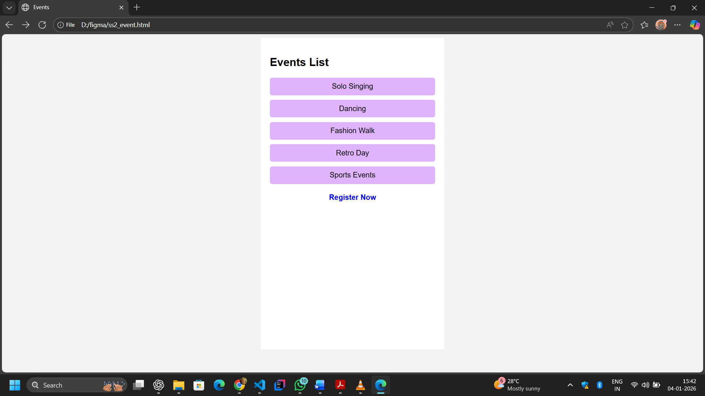
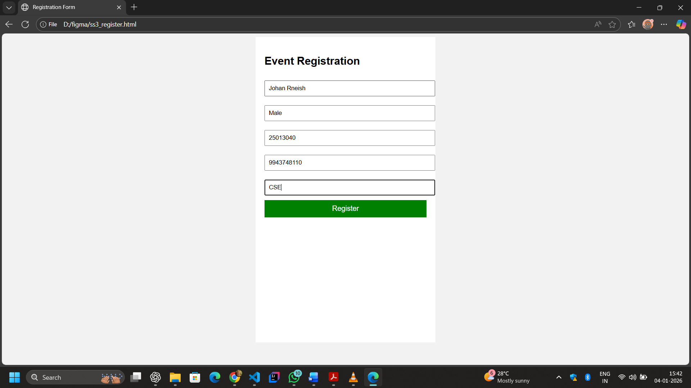
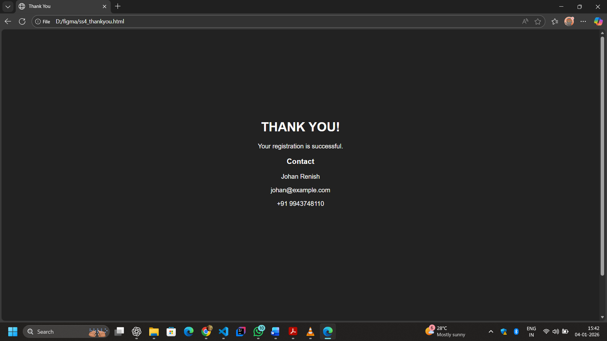

# Ex09 Event Registration Web Application
## Date:25/12/25

## AIM:
To design, develop and deploy a web application for event registration.

## DESIGN STEPS:

### Step 1:
Create a new frame.

### Step 2:
Select any one preset size of your choice.

### Step 3:
Select the shapes you need.

### Step 4:
Import images as needed.

### Step 5:
Create pages based on your need and link them.

### Step 6:

Validate the HTML and CSS code.

### Step 6:

Publish the website in the given URL.

## DESIGN TOOL:
Figma

## CODE:
ss-1_hemo.html
```
<!DOCTYPE html>
<html>
<head>
  <title>Event Registration - Home</title>
  <style>
    body {
      margin: 0;
      font-family: Arial, sans-serif;
    }
    .screen {
      width: 360px;
      height: 640px;
      background: linear-gradient(#6a11cb, #2575fc);
      color: white;
      text-align: center;
      padding-top: 200px;
      margin: auto;
    }
    a {
      display: inline-block;
      margin-top: 40px;
      padding: 10px 20px;
      background: white;
      color: black;
      text-decoration: none;
      font-weight: bold;
      border-radius: 5px;
    }
  </style>
</head>
<body>

<div class="screen">
  <h1>Welcome</h1>
  <h2>College Event Registration</h2>
  <a href="ss2_events.html">View Events</a>
</div>

</body>
</html>

```
ss2_event.html:
```
<!DOCTYPE html>
<html>
<head>
  <title>Events</title>
  <style>
    body {
      font-family: Arial;
      background: #f2f2f2;
    }
    .screen {
      width: 360px;
      height: 640px;
      background: white;
      margin: auto;
      padding: 20px;
    }
    .event {
      background: #e0b3ff;
      margin: 10px 0;
      padding: 10px;
      border-radius: 5px;
      text-align: center;
    }
    a {
      display: block;
      margin-top: 20px;
      text-align: center;
      text-decoration: none;
      font-weight: bold;
      color: blue;
    }
  </style>
</head>
<body>

<div class="screen">
  <h2>Events List</h2>

  <div class="event">Solo Singing</div>
  <div class="event">Dancing</div>
  <div class="event">Fashion Walk</div>
  <div class="event">Retro Day</div>
  <div class="event">Sports Events</div>

  <a href="ss3_register.html">Register Now</a>
</div>

</body>
</html>
```
ss3_register.html
```
<!DOCTYPE html>
<html>
<head>
  <title>Registration Form</title>
  <style>
    body {
      font-family: Arial;
      background: #f2f2f2;
    }
    .screen {
      width: 360px;
      height: 640px;
      background: white;
      margin: auto;
      padding: 20px;
    }
    input {
      width: 100%;
      padding: 8px;
      margin: 10px 0;
    }
    button {
      width: 100%;
      padding: 10px;
      background: green;
      color: white;
      border: none;
      font-size: 16px;
    }
  </style>
</head>
<body>

<div class="screen">
  <h2>Event Registration</h2>

  <input type="text" placeholder="Name">
  <input type="text" placeholder="Gender">
  <input type="text" placeholder="Register Number">
  <input type="text" placeholder="Phone Number">
  <input type="text" placeholder="Department">

  <a href="ss4_thankyou.html">
    <button>Register</button>
  </a>
</div>

</body>
</html>

```
ss4_thankyou.html
```
<!DOCTYPE html>
<html>
<head>
  <title>Thank You</title>
  <style>
    body {
      font-family: Arial;
      background: #222;
      color: white;
    }
    .screen {
      width: 360px;
      height: 640px;
      margin: auto;
      text-align: center;
      padding-top: 200px;
    }
  </style>
</head>
<body>

<div class="screen">
  <h1>THANK YOU!</h1>
  <p>Your registration is successful.</p>

  <h3>Contact</h3>
  <p>Johan Renish</p>
  <p>johan@example.com</p>
  <p>+91 9943748110</p>
</div>

</body>
</html>

```

## OUTPUT:
Home Page 

Event Page

Registration page

Thankyou Page

## RESULT:
The program to design, develop and deploy a web application for event registration is completed successfully.
